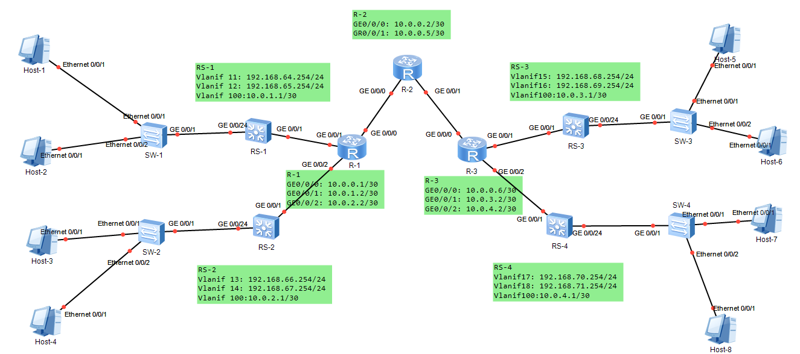

# Network-Engineering

 网络工程实训项目

## Project-04 使用路由器构建园区网

Building campus network using **static routing**.



SKILL: using **Route Summarization** to simplify routing-table


## Project-05 RIP的应用

Building campus network using **RIP protocal**.


## Project-06 OSPF的应用

Building campus network using **OSPF protocal**.


## Project-07 使用BGP实现不同AS之间通信

Using **BGP protocal** to connect two different subnets to build the campus network.

```
AS100(RIP)----BGP----AS200(OSPF)
```

